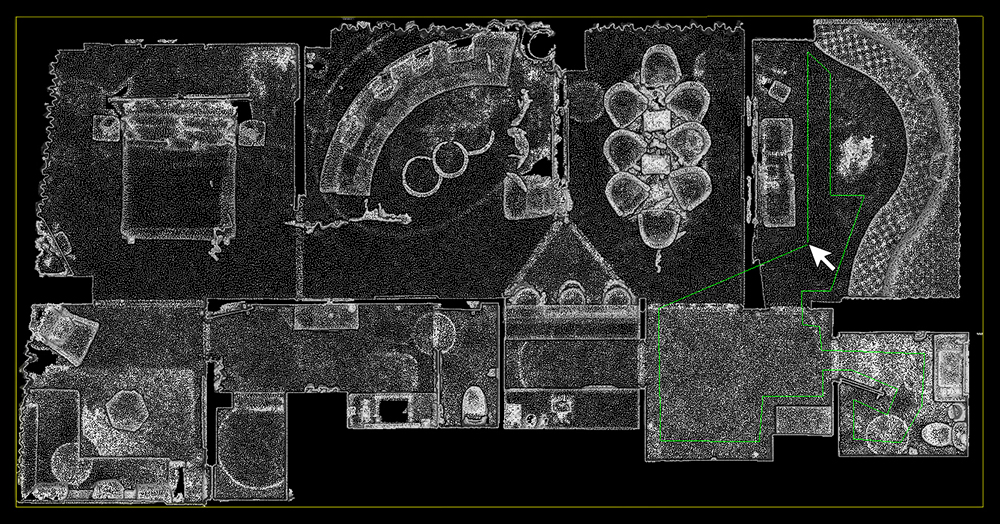

## Repository Setup

The repository provides the base navigation system for the CMU Vision-Language-Autonomy Challenge. The system is integrated with [Matterport3D](https://niessner.github.io/Matterport) photorealistic environment models and [AI Habitat](https://github.com/facebookresearch/habitat-sim) engine. The repository has been tested in Ubuntu 20.04 with [ROS Noetic](http://wiki.ros.org/noetic/Installation). Install dependencies with the command lines below.
```
sudo apt update
sudo apt install libusb-dev
```
Clone the open-source repository.
```
git clone https://github.com/jizhang-cmu/cmu_vla_challenge_matterport.git
```
In a terminal, go to the folder and compile.
```
cd cmu_vla_challange_matterport
catkin_make
```
Install [Anaconda](https://www.anaconda.com/download) and accept the default installation directory in the home folder. Then, in a terminal, create a conda environment named 'habitat' using the provided spec file.
```
conda create --name habitat --file habitat_spec_file.txt
```
Alternatively, users can create the conda environment by following step-by-step instructions on the [AI Habitat website](https://github.com/facebookresearch/habitat-sim).

## Model Preparation

Go to [Matterport3D website](https://niessner.github.io/Matterport), sign Terms of Use, and download the environment models using the given download_mp.py script. Running the script requires Python 2.7.
```
python2 download_mp.py -o data_download_dir
```
Then, run the script again with '--task habitat' flag to download the files prepared for AI Habitat.
```
python2 download_mp.py --task habitat -o data_download_dir
```
In the two downloads, find the matching environment ID. Here, we use ID:17DRP5sb8fy as an example, which is for the first downloaded environment model. In the first download, find the matterport_mesh.zip file, unzip it, rename the .obj file to a matterport.obj file, and copy all the files, i.e. .obj, .jpg, .mtl, to the 'src/vehicle_simulator/mesh/matterport/meshes' folder. You can also find a house_segmentations.zip file, extract the .ply file and rename it to a map.ply file, and copy it to the 'src/vehicle_simulator/mesh/matterport/pointclouds' folder.

In the second download, find the mp3d_habitat.zip file and extract the files with the same environment ID: 17DRP5sb8fy, then rename the files to matterport.glb, matterport.house, matterport.navmesh, matterport_semantic.ply, and copy the files to the 'src/vehicle_simulator/mesh/matterport/segmentations' folder.

**Setting start point** - Matterport3D environment models often have multiple floors. We recommend using CloudCompare (installed with 'snap install cloudcompare') to choose the vehicle start point on the desired floor. Load the map.ply file renamed and copied from the first download. Then, use 'Tools->Segmentation->Cross Section' to crop off the ceiling and unused floors to reveal the start area.

<p align="center">
  
</p>

Use 'Tools/Point picking' to choose the start point and set the values of 'vehicleX', 'vehicleY', 'terrainZ' in 'src/vehicle_simulator/launch/system_matterport.launch' (default values are (0, 0, 0)). You can further save the cropped point cloud as a new map.ply file and replace the original file.

<p align="center">
  
</p>

**Selecting traversable area** - To select the traversable area for navigation, we need to only load the x, y, z fields in the map.ply file to CloudCompare (loading the file as a plain point cloud).

<p align="center">
  
</p>

Use 'Edit->Segment' to extract the region that you want the vehicle to traverse.

<p align="center">
  
</p>

Save the extracted point cloud to a traversable_area.ply file and copy it to the 'src/vehicle_simulator/mesh/matterport/pointclouds' folder. The image below shows our extracted point cloud. The traversable_area.ply file is used by the system to check the traversability of the waypoints. Users may skip this file and the system will accept waypoints placed anywhere in the environment.

<p align="center">
  
</p>

The prepared environment model files should look like below.

mesh/<br>
&nbsp;&nbsp;&nbsp;&nbsp;matterport/<br>
&nbsp;&nbsp;&nbsp;&nbsp;&nbsp;&nbsp;&nbsp;&nbsp;meshes/<br>
&nbsp;&nbsp;&nbsp;&nbsp;&nbsp;&nbsp;&nbsp;&nbsp;matterport.obj<br>
&nbsp;&nbsp;&nbsp;&nbsp;&nbsp;&nbsp;&nbsp;&nbsp;xxx.jpg (multiple files)<br>
&nbsp;&nbsp;&nbsp;&nbsp;&nbsp;&nbsp;&nbsp;&nbsp;xxx.mtl (one file)<br>
&nbsp;&nbsp;&nbsp;&nbsp;pointclouds/<br>
&nbsp;&nbsp;&nbsp;&nbsp;&nbsp;&nbsp;&nbsp;&nbsp;map.ply<br>
&nbsp;&nbsp;&nbsp;&nbsp;&nbsp;&nbsp;&nbsp;&nbsp;traversable_area.ply (optional)<br>
&nbsp;&nbsp;&nbsp;&nbsp;segmentations/<br>
&nbsp;&nbsp;&nbsp;&nbsp;&nbsp;&nbsp;&nbsp;&nbsp;matterport.glb<br>
&nbsp;&nbsp;&nbsp;&nbsp;&nbsp;&nbsp;&nbsp;&nbsp;matterport.house<br>
&nbsp;&nbsp;&nbsp;&nbsp;&nbsp;&nbsp;&nbsp;&nbsp;matterport.navmesh<br>
&nbsp;&nbsp;&nbsp;&nbsp;&nbsp;&nbsp;&nbsp;&nbsp;matterport_semantic.ply<br>
&nbsp;&nbsp;&nbsp;&nbsp;model.config<br>
&nbsp;&nbsp;&nbsp;&nbsp;model.sdf

## System Launch

In a terminal, go to the 'cmu_vla_challange_matterport' folder and bring up the system.
```
./system_bring_up.sh
```
Users should see data showing up in RVIZ. Click 'Panels->Display' and check the data to view. Users can also use the 'Waypoint with Heading' button to navigate the vehicle. **To set the waypoint, press the left button on the mouse to choose the position, then move the mouse to choose the orientation before releasing the left button.** The vehicle will navigate to the waypoint avoiding collisions on the way and then turn to the orientation. Note that the waypoints are meant to be relatively close to the vehicle. Setting the waypoint too far can cause the vehicle to stuck at a dead end.

<p align="center">
  
</p>

Users can also use the control panel to navigate the vehicle by clicking inside the black box. The system will switch to *smart joystick* mode - the vehicle tries to follow the joystick command and avoid collisions at the same time. To resume waypoint navigation, press the 'Resume Navigation to Goal' button. Note that users can use a PS3/4 or Xbox controller with a USB or Bluetooth interface instead of the virtual joystick (If using the Xbox Wireless USB Adapter, please install [xow](https://github.com/medusalix/xow)). Users can use the right joystick on the controller to navigate the vehicle. Holding the obstacle-check button cancels obstacle checking and clicking the clear-terrain-map button reinitializes the terrain map. To resume waypoint navigation, hold the mode-switch button and at the same time push the right joystick. This way, the right joystick gives the speed. If only holding the mode-switch button, the system will use the default speed.

<p align="center">
  
  &nbsp;&nbsp;&nbsp;&nbsp;
  
</p>

**Troubleshooting** - If the system does not launch correctly, open the 'system_bring_up.sh' file in a text editor and check if the paths defined at the top, i.e. CONDA_DIR, CONDA_BIN_DIR, CONDA_SETUP_FILE, CONDA_PROFILE_FILE, match the Anaconda installation on your computer. If the system is still not working, users can launch the autonomy system and AI Habiat in two separate terminals. In a terminal, go to the 'cmu_vla_challange_matterport' folder and bring up the autonomy system.
```
source devel/setup.sh  
roslaunch vehicle_simulator system_matterport.launch 
```
In a second terminal, go to the 'cmu_vla_challange_matterport/src/segmentation_proc/scripts' folder and run AI Habitat.
```
conda activate habitat
python3 ./habitat_online_v0.2.1.py
```

## Credits

[velodyne_simulator](http://wiki.ros.org/velodyne_simulator) and [joystick_drivers](http://wiki.ros.org/joystick_drivers) packages are from open-source releases.

## Relevant Links

The repository is based on [Autonomous Exploration Development Environment](https://www.cmu-exploration.com).

[Far Planner](https://github.com/MichaelFYang/far_planner): a visibility graph-based route planner.
